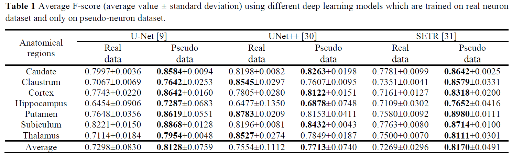

# PseudoNeuronGAN: Unpaired synthetic image to pseudo-neuron image translation for unsupervised neuron instance segmentation in microscopic images of macaque brain

We provide PyTorch implementations for unpaired synthetic image to pseudo-neuron image translation.


## Requirements
- Linux or Windows
- Python 3
- CPU or NVIDIA GPU + CUDA CuDNN
- pytorch 1.13.0
- pytorch-cuda 11.6
- torchvision 0.14.0


## Dataset

You can build your own dataset by setting up the following directory structure:

    .
    ├── train              # Training
    |   ├── A              # Contains domain A images (i.e. synthetic)
    |   ├── centroid_A     # Contains domain A centroid images (i.e. centroid_synthetic)
    |   └── B              # Contains domain B images (i.e. neuron)
    ├── test               # Testing
    |   ├── A              # Contains domain A images (i.e. synthetic)
    |   └── B              # Contains domain B images (i.e. neuron)


## Train

```
python train.py --epochs 100
``` 

* `batch_size`: type=int, default=1.
* `image_size`: type=int, default=512.
* `epochs`: type=int, default=100.
* `learning_rate`: type=float, default=1e-5.
* `input_nc` : type=int, default=3.
* `output_nc` : type=int, default=3.


Note: 
This command will start a training session using the images under the *train* directory. The parameters can be changed. Both generators and discriminators weights will be saved under the directory of *PseudoNeuronGAN_epochs100*. 


## Test

Download the pre-trained weight in ```PseudoNeuronGAN``` directory ([google drive](https://drive.google.com/drive/...) or [baidu pan](https://pan.baidu.com/s/1VaocTBdpDhHUEEtN1XSrhg?pwd=mrjq)).

The model netG_A2B.pth translates from synthetic image to pseudo-neuron image, netG_B2A.pth is used in another direction. We are interested in the *A2B* direction.

```
python test.py 
``` 

Note: 
The model directly translates all the images from the directory *test*. All the results will be saved under the directory of *PseudoNeuronGAN_epochs100*. 


## Neuron segmentation

Existing fully supervised deep learning models trained using this pseudo-neuron dataset with location labels can be used to predict the centroids of real neuron images. Neuron instance segmentation can be further performed by applying a competitive region growing algorithm. Experiments show that our model succeeds in generating a pseudo-neuron dataset. This greatly liberated neuroscientists, and the accuracy of location labels is no longer influenced by subjective factors. 




## Acknowledgments
Our code is inspired by [PyTorch-CycleGAN](https://github.com/aitorzip/PyTorch-CycleGAN).
